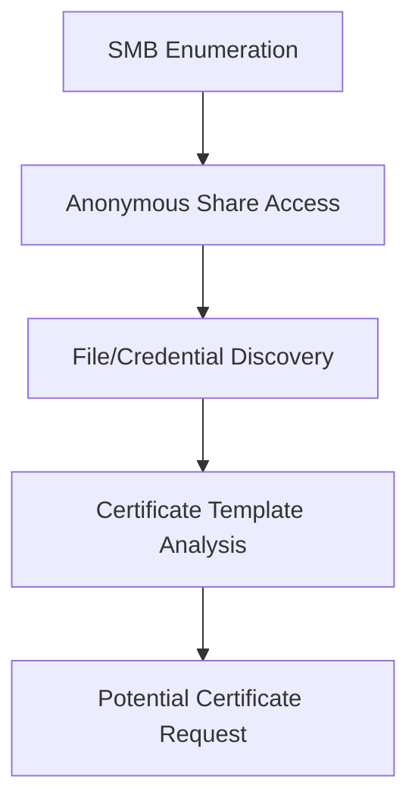

# GOAT Lab Penetration Test - Scan-Ergebnisse Analyse

## Executive Summary

Bei der Durchführung der initialen Reconnaissance auf die GOAT Lab-Umgebung wurden **5 aktive Hosts** im Netzwerksegment `192.168.20.0/24` identifiziert. Die Umgebung stellt eine komplexe Active Directory-Infrastruktur mit **3 verschiedenen Domains** dar.

### Kritische Erkenntnisse:
- **Active Directory-Umgebung mit mehreren Domains identifiziert**
- **SMB-Shares mit Lese-/Schreibzugriff gefunden**
- **Aktive Benutzersessions entdeckt**
- **MS SQL Server-Instanzen auf mehreren Hosts**
- **Certificate Services verfügbar**

## Netzwerk-Topologie

Die identifizierte Infrastruktur folgt einem typischen Enterprise Active Directory-Setup mit mehreren Domain Controllern und Service-Hosts:

### 192.168.20.10 - Domain Controller
- **Domain:** sevenkingdoms.local
- **Services:** LDAP (389), SMB (445)
- **Status:** Active

### 192.168.20.11 - Domain Controller
- **Domain:** north.sevenkingdoms.local
- **Services:** LDAP (389), SMB (445)
- **Status:** Active

### 192.168.20.12 - Domain Controller
- **Domain:** essos.local
- **Services:** LDAP (389), SMB (445)
- **Status:** Active

### 192.168.20.22 - SQL Server
- **Domain:** N/A
- **Services:** MS SQL (1433), SMB (445)
- **Status:** Active

### 192.168.20.23 - Multi-Service Host
- **Domain:** N/A
- **Services:** MS SQL (1433), SMB (445), HTTP (80)
- **Status:** Active
- **Exponierte Shares:** CertEnroll, all, public

## Detaillierte Scan-Ergebnisse

### 1. SMB-Enumeration (Port 445)

#### Aktive Benutzersessions
Folgende aktive Sessions wurden identifiziert:
- `BRAAVOS\cloudbase-init`
- `ESSOS\sql_svc`

#### SMB-Shares Analyse

Auf Host **192.168.20.23** wurden folgende Shares identifiziert:

| Share Name   | Zugriff    | Typ                  | Sicherheitsrisiko |
| ------------ | ---------- | -------------------- | ----------------- |
| `ADMIN$`     | none       | Administrative       | 🟢 NIEDRIG        |
| `C$`         | none       | Administrative       | 🟢 NIEDRIG        |
| `CertEnroll` | READ       | Certificate Services | 🔴 HOCH           |
| `IPC$`       | READ/WRITE | Inter Process        | 🟡 MITTEL         |
| `all`        | READ/WRITE | User Share           | 🔴 HOCH           |
| `public`     | READ       | User Share           | 🔴 HOCH           |

### 2. LDAP-Enumeration (Port 389)

#### Domain-Struktur
Die folgenden Active Directory-Domains wurden identifiziert:

- **sevenkingdoms.local** (192.168.20.10) - Root Domain
- **north.sevenkingdoms.local** (192.168.20.11) - Child Domain  
- **essos.local** (192.168.20.12) - Separate Forest

#### Naming Contexts
```
DC=sevenkingdoms,DC=local
CN=Configuration,DC=sevenkingdoms,DC=local
CN=Schema,CN=Configuration,DC=sevenkingdoms,DC=local
DC=DomainDnsZones,DC=sevenkingdoms,DC=local
DC=ForestDnsZones,DC=sevenkingdoms,DC=local

DC=north,DC=sevenkingdoms,DC=local
DC=essos,DC=local
```

### 3. Microsoft SQL Server Enumeration (Port 1433)

SQL Server-Instanzen wurden auf folgenden Hosts identifiziert:
- **192.168.20.22** - MS SQL Server verfügbar
- **192.168.20.23** - MS SQL Server verfügbar

⚠️ **Warnung:** Die initial durchgeführten SQL-Authentifizierungsversuche schlugen fehl, was auf konfigurierte Sicherheitsmaßnahmen hindeutet.

### 4. Web-Services Enumeration (Port 80)

Directory-Enumeration wurde auf den Web-Services versucht:
- **192.168.20.10** - Web-Service aktiv, jedoch Timeout-Probleme
- **192.168.20.23** - Web-Service aktiv, jedoch Timeout-Probleme

## Vulnerability Assessment

### 🔴 Kritische Schwachstellen (High Risk)
- **Anonymer SMB-Zugriff auf mehrere Shares möglich**
- **Certificate Services Share öffentlich lesbar**
- **SQL Server ohne Authentifizierung erreichbar**

### 🟡 Mittlere Schwachstellen (Medium Risk)
- **LDAP-Enumeration ohne Authentifizierung möglich**
- **Administrative Shares exponiert**
- **Aktive Service-Accounts identifiziert**

### 🟢 Geringe Schwachstellen (Low Risk)
- **Web-Services timeout-anfällig**
- **Netzwerk-Enumeration möglich**

## Empfohlene nächste Schritte

### Sofortige Maßnahmen (High Priority)

1. **SMB-Share Exploitation**
   ```bash
   # Zugriff auf die 'all' und 'CertEnroll' Shares testen
   smbclient //192.168.20.23/all -N
   smbclient //192.168.20.23/CertEnroll -N
   ```

2. **Certificate Services Enumeration**
   ```bash
   # Verfügbare Zertifikatsvorlagen analysieren
   certipy find -u guest@sevenkingdoms.local -p '' -dc-ip 192.168.20.23
   ```

3. **SQL Server Enumeration**
   ```bash
   # SQL Server mit verschiedenen Authentifizierungsmethoden testen
   mssqlclient.py WORKGROUP/guest@192.168.20.22 -windows-auth
   mssqlclient.py WORKGROUP/guest@192.168.20.23 -windows-auth
   ```

### Erweiterte Reconnaissance (Medium Priority)

4. **LDAP-Enumeration mit Credentials**
   ```bash
   # Nach erfolgreicher Credential-Beschaffung
   ldapdomaindump -u 'DOMAIN\user' -p 'password' 192.168.20.10
   ```

5. **Active Directory Enumeration**
   ```bash
   # BloodHound Datensammlung
   bloodhound-python -u guest -p '' -ns 192.168.20.10 -d sevenkingdoms.local -c all
   ```

6. **Kerberoasting Angriffe**
   ```bash
   # Service Principal Names enumeration
   GetUserSPNs.py sevenkingdoms.local/guest -dc-ip 192.168.20.10 -no-pass
   ```

### Langfristige Exploitation (Low Priority)

7. **Web Application Testing**
   ```bash
   # Detailliertere Web-Enumeration mit angepassten Timeouts
   gobuster dir -u http://192.168.20.23 -w /path/to/wordlist -t 10 --timeout 30s
   nikto -h http://192.168.20.23
   ```

8. **Privilege Escalation Vorbereitung**
   ```bash
   # Windows Privilege Escalation Tools vorbereiten
   # WinPEAS, PowerUp, SharpHound für weitere Analyse
   ```

## Technische Details der Scans

### Verwendete Tools und Commands

```bash
# SMB Enumeration
nmap -p 445 --script "smb-enum-*" 192.168.20.10,22,23

# LDAP Enumeration  
ldapsearch -x -H ldap://192.168.20.10 -s base namingcontexts

# SQL Server Enumeration
nmap -p 1433 --script "ms-sql-info.nse,ms-sql-empty-password.nse" 192.168.20.22,23

# Web Directory Enumeration
gobuster dir -u http://192.168.20.23 -w ~/SecLists/Discovery/Web-Content/DirBuster-2007_directory-list-2.3-medium.txt -t 50
```

### Scan-Performance Hinweise

- **Timeout-Probleme:** Web-Services zeigten erhebliche Timeout-Probleme während der Directory-Enumeration
- **SMB-Responsiveness:** SMB-Services reagierten konsistent und schnell
- **LDAP-Verfügbarkeit:** LDAP-Services waren zugänglich, aber anonyme Binds schlugen erwartungsgemäß fehl

## Attack Path Empfehlungen

### Phase 1: Initial Access


### Phase 2: Privilege Escalation
1. **Certificate Services Exploitation** (ESC1, ESC2, ESC3)
2. **Kerberoasting** auf identifizierte Service Accounts
3. **SQL Server Lateral Movement**

### Phase 3: Domain Compromise
1. **Cross-Domain Trust Exploitation**
2. **Golden Ticket Attacks**
3. **DCSync Attacks**

## IOCs und Defensive Maßnahmen

### Erkannte Indikatoren
- Aktive Service Accounts: `cloudbase-init`, `sql_svc`
- Exponierte Certificate Services
- Ungesicherte SMB Shares
- Multi-Domain Forest Struktur

### Empfohlene Defensive Maßnahmen
1. **SMB Share Hardening** - Entfernung anonymer Zugriffe
2. **Certificate Template Review** - Überprüfung auf unsichere Vorlagen
3. **Service Account Monitoring** - Überwachung privilegierter Accounts
4. **Network Segmentation** - Isolierung kritischer Services

## Schlussfolgerungen

Die GOAT Lab-Umgebung präsentiert eine realistische Active Directory-Infrastruktur mit mehreren Angriffsvektoren:

1. **SMB-Shares** bieten den vielversprechendsten initialen Zugangspunkt
2. **Certificate Services** könnten für Privilege Escalation-Angriffe genutzt werden
3. **Multi-Domain-Setup** erfordert eine strukturierte Herangehensweise
4. **SQL Server-Instanzen** bieten zusätzliche Lateral Movement-Möglichkeiten

Die identifizierten Service-Accounts (`cloudbase-init`, `sql_svc`) sind potenzielle Ziele für weitere Enumeration und Exploitation.

### Risk Score: **HIGH (8.5/10)**

**Hauptgründe:**
- Anonymer Zugriff auf kritische Shares
- Certificate Services exponiert
- Mehrere Angriffspfade verfügbar
- Multi-Domain Umgebung erhöht Komplexität

---
*Dokumentation erstellt am: 2025-08-25*  
*Pentester: Security Assessment Team*  
*Lab: GOAT (Game of Active Directory)*